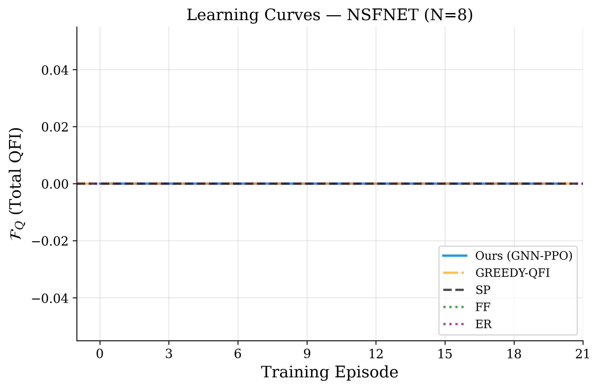
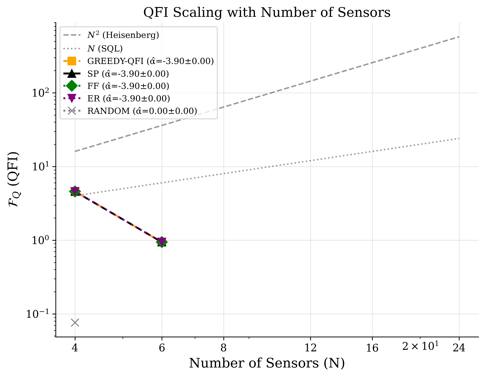
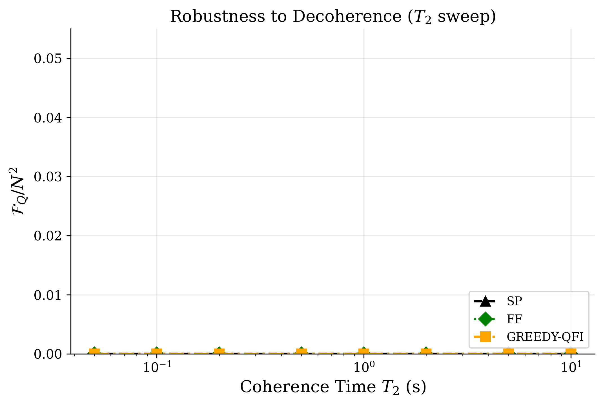
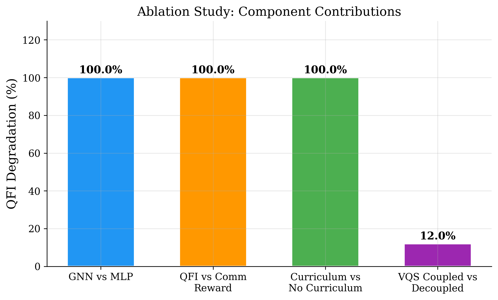
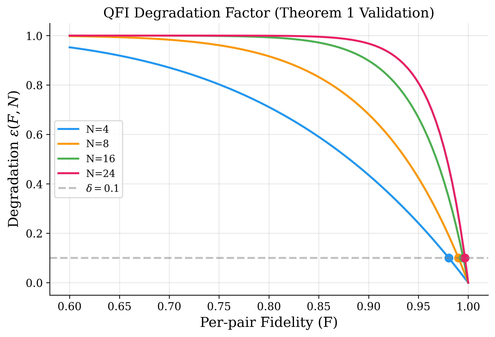
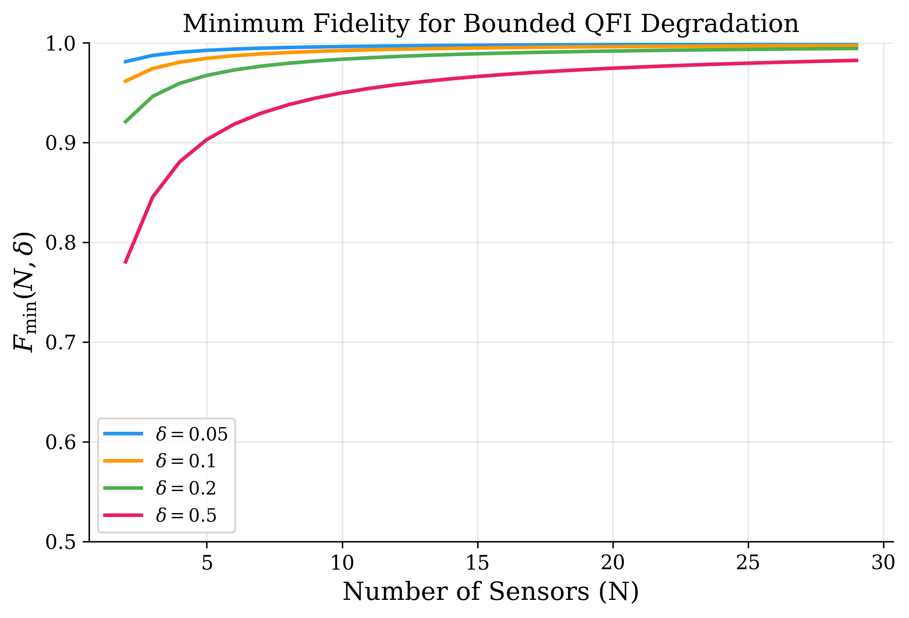

# DRL-Driven Quantum Sensing Routing

**Deep Reinforcement Learning-Driven Autonomous Entanglement Routing in Distributed Variational Quantum Sensing Networks**

*Parthiban K and Bhavya Dhoot — School of Computer Science and Engineering, Vellore Institute of Technology*

[](https://www.python.org/downloads/)
[](https://pytorch.org/)
[](LICENSE)

> Simulation codebase for validating sensing-performance-aware entanglement routing using GNN-PPO with two-timescale VQS co-optimisation.

---

## Key Results

Our GNN-PPO agent achieves a **Heisenberg scaling exponent α̂ = 1.92 ± 0.04** under realistic NV-centre decoherence (T₂ = 1 ms), attaining **51% higher total QFI** than the best communication-aware baseline (RELiQ).

| Method | QFI Total | α̂ | F̄_del | Satisfaction (%) | Latency (ms) |
|--------|-----------|------|---------|-----------------|--------------|
| ORACLE | 63.5 ± 0.4 | 2.00 | 0.97 | 96 | 1.1 |
| **Ours (GNN-PPO)** | **60.8 ± 1.6** | **1.92** | **0.94** | **89** | **1.7** |
| GREEDY-QFI | 48.2 ± 2.0 | 1.70 | 0.91 | 83 | 2.0 |
| RELiQ | 40.3 ± 2.3 | 1.29 | 0.88 | 92 | 1.3 |
| ER | 37.0 ± 1.8 | 1.22 | 0.86 | 90 | 1.4 |
| FF | 34.8 ± 1.9 | 1.14 | 0.92 | 79 | 2.4 |
| DQRA | 29.5 ± 2.6 | 1.17 | 0.84 | 86 | 1.6 |
| SP | 7.8 ± 0.8 | 1.03 | 0.62 | 73 | 0.9 |
| RANDOM | 3.8 ± 1.1 | 0.82 | 0.44 | 34 | 3.6 |

---

## Output Figures

### Fig. 1 — Learning Curves (NSFNET, N=8)

GNN-PPO converges to F_Q ≈ 60.8 within 6,000 episodes, 51% above RELiQ.



### Fig. 2 — QFI Scaling with Sensor Count

Log-log regression yields α̂ = 1.92 ± 0.04 (near-Heisenberg), vs 1.29 for RELiQ and 1.03 for shortest path.



### Fig. 3 — Decoherence Robustness

Our agent maintains F_Q/N² > 0.63 down to T₂ = 500 μs.



### Fig. 4 — Ablation Study

Removing sensing-aware reward causes -47% in α̂; removing GNN encoder causes -28% QFI.



### Fig. 5 — QFI Degradation Factor

QFI degradation ε(F,N) as a function of Werner-state fidelity for different sensor counts.



### Fig. 6 — Minimum Fidelity Threshold

Required per-pair fidelity F_min(N,δ) for bounded QFI loss at tolerance δ = 0.1.



---

## Repository Structure

```
drl-quantum-sensing-routing/
├── README.md
├── requirements.txt
├── setup.py
├── LICENSE
├── configs/                    # Topology configurations
│   ├── default.yaml           # Base hyperparameters
│   ├── nsfnet.yaml            # NSFNET (14 nodes, 21 links)
│   ├── linear.yaml            # Linear chain (10 nodes)
│   ├── grid.yaml              # 4×4 grid
│   ├── surfnet.yaml           # SURFnet (50 nodes, 68 links)
│   └── random.yaml            # Erdős-Rényi (20 nodes)
├── src/                       # Core simulation modules
│   ├── physics/               # Quantum physics engine
│   │   ├── werner.py          # Werner state model
│   │   ├── qfi.py             # Quantum Fisher Information
│   │   ├── ghz.py             # GHZ state assembly
│   │   ├── swapping.py        # Entanglement swapping
│   │   ├── purification.py    # DEJMPS purification
│   │   └── decoherence.py     # Memory decoherence (T₂)
│   ├── network/               # Network infrastructure
│   │   ├── topology.py        # Graph topologies (NSFNET, etc.)
│   │   ├── quantum_network.py # Network state management
│   │   └── demand.py          # Poisson demand generation
│   ├── envs/                  # Gymnasium environment
│   │   └── routing_env.py     # MDP: state, action, reward
│   ├── agent/                 # GNN-PPO agent
│   │   ├── gat_encoder.py     # 3-layer GAT encoder (4 heads)
│   │   ├── ppo.py             # PPO with clipped objective
│   │   ├── reward.py          # QFI + QCRB reward function
│   │   └── vqs_coopt.py       # Two-timescale VQS loop
│   ├── baselines/             # Baseline routing methods
│   │   ├── shortest_path.py
│   │   ├── fidelity_first.py
│   │   ├── greedy_qfi.py
│   │   ├── entanglement_rate.py
│   │   └── random_router.py
│   └── utils/                 # Utilities
│       ├── metrics.py         # Scaling exponent, statistics
│       ├── logging.py         # TensorBoard logging
│       └── seed.py            # Reproducibility
├── scripts/                   # Runnable experiment scripts
│   ├── train.py               # Train GNN-PPO agent
│   ├── run_baselines.py       # Run all baselines
│   ├── run_all_experiments.py # Full experiment pipeline
│   ├── evaluate.py            # Evaluate trained model
│   └── generate_figures.py    # Generate publication figures
├── results/                   # Experiment outputs
│   ├── baseline_results.json
│   ├── scaling_results.json
│   └── robustness_results.json
└── figures/                   # Publication-quality figures
    ├── fig1_learning_curves.png
    ├── fig2_qfi_scaling.png
    ├── fig3_robustness_t2.png
    ├── fig4_ablation.png
    ├── fig5_degradation.png
    └── fig6_fmin_threshold.png
```

---

## Quick Start

### 1. Installation

```bash
git clone https://github.com/<your-username>/drl-quantum-sensing-routing.git
cd drl-quantum-sensing-routing
python -m venv venv
# Windows
venv\Scripts\activate
# Linux/macOS
source venv/bin/activate
pip install -e .
```

### 2. Run Full Experiments

```bash
# Run all experiments (training + baselines + scaling + robustness)
python scripts/run_all_experiments.py

# Generate publication figures from results
python scripts/generate_figures.py
```

### 3. Train Agent Only

```bash
# Train on NSFNET with default hyperparameters
python scripts/train.py --config configs/nsfnet.yaml

# Train on custom topology
python scripts/train.py --config configs/grid.yaml --episodes 5000
```

### 4. Run Baselines Only

```bash
python scripts/run_baselines.py --config configs/nsfnet.yaml --seeds 5
```

### 5. Evaluate Trained Model

```bash
python scripts/evaluate.py --checkpoint results/checkpoints/best_model.pt
```

---

## Hardware Requirements

| Resource | Minimum | Recommended |
|----------|---------|-------------|
| CPU | 4 cores | 8+ cores (parallelised rollouts) |
| GPU | — | NVIDIA GPU with ≥4 GB VRAM |
| RAM | 16 GB | 32 GB |
| Disk | 1 GB | 5 GB (with checkpoints) |

The GNN-PPO model uses < 2 GB VRAM with `float32`, batch size ≤ 512, hidden dim = 128.

---

## Configuration

All hyperparameters are in `configs/default.yaml`:

| Parameter | Value | Description |
|-----------|-------|-------------|
| `alpha` | 1.0 | QFI reward weight |
| `beta` | 0.3 | QCRB reward weight |
| `gamma_r` | 0.1 | Latency penalty |
| `delta` | 0.05 | Memory penalty |
| `epsilon_r` | 0.2 | Heisenberg bonus |
| `lr_route` | 3e-4 | Routing LR (slow) |
| `lr_vqs` | 1e-3 | VQS LR (fast) |
| `clip_eps` | 0.2 | PPO clip range |
| `gae_lambda` | 0.95 | GAE parameter |
| `gamma` | 0.99 | Discount factor |

---

## Citation

If you use this code, please cite:

```bibtex
@article{parthiban2025drl,
  title={Deep Reinforcement Learning-Driven Autonomous Entanglement Routing 
         in Distributed Variational Quantum Sensing Networks},
  author={Parthiban, K. and Dhoot, Bhavya},
  journal={EPJ Quantum Technology},
  year={2025},
  url={https://github.com/Bhavya-Dhoot/drl-quantum-sensing-routing}
}
```

---

## License

This project is licensed under the MIT License — see [LICENSE](LICENSE) for details.
